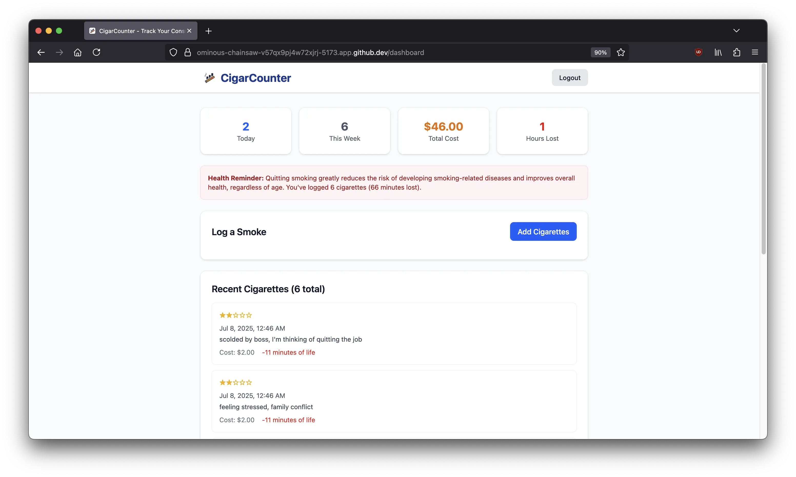

 

# [CigarCounter](https://cigarcounter.vercel.app/)

**CigarCounter** is a minimalist, privacy-conscious web app that helps you **track every cigarette or cigar you smoke**. By visualizing your habits and raising awareness about health risks, it’s designed to encourage users to quit smoking through self-awareness — one log at a time.



> [!NOTE]  
> Give this project a try by signing up an account [here](https://cigarcounter.vercel.app/auth), feedbacks are welcomed in the [issues](https://github.com/leecheeyong/cigarcounter/issues). Give this project a ⭐ if you like it 😄

## 🌟 Features

- 📅 **Track Each Smoke** – Log every cigarette or cigar you consume in seconds.
- 📈 **Insightful Dashboard** – Visualize your daily, weekly habits.
- ❤️ **Health Impact Awareness** – See how each smoke affects your life expectancy.
- 💶 **Financial Impact Awareness** - Tracking your consumption not only helps your health — it also helps your wallet.
- 🔐 **Privacy-first** – No ads, no tracking. Your data stays yours.
- 🌐 **Responsive** – Works on desktop, tablet, and mobile.

## 🚀 Getting Started

### 1. Clone this repository
```bash
git clone https://github.com/leecheeyong/cigarcounter.git
cd cigarcounter
npm install
npm run dev
```

### 2. 🔥 Set up Firebase

- Go to [Firebase Console](https://console.firebase.google.com/) and create a new project.
- Enable **Authentication** (Email/Password).
- Set up **Cloud Firestore** in test mode (or with secured rules).
- Copy your Firebase config.

### 3. 📄 Add Firebase config

Edit the `src/firebase/config.ts` file, replace with your Firebase credentials

## License
This project is licensed under the MIT License. See the [LICENSE](/LICENSE) file for details.
