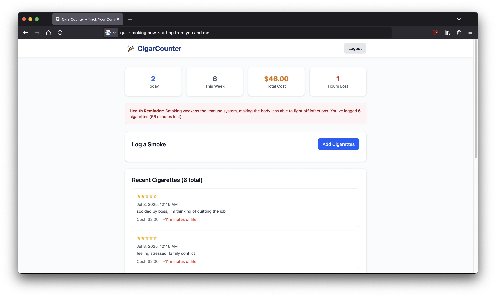

 

# CigarCounter

**CigarCounter** is a minimalist, privacy-conscious web app that helps you **track every cigarette or cigar you smoke**. By visualizing your habits and raising awareness about health risks, it’s designed to encourage users to quit smoking through self-awareness — one log at a time.

## 🌟 Features

- 📅 **Track Each Smoke** – Log every cigarette or cigar you consume in seconds.
- 📈 **Insightful Dashboard** – Visualize your daily, weekly habits.
- ❤️ **Health Impact Awareness** – See how each smoke affects your life expectancy.
- 💶 **Financial Impact Awareness** - Tracking your consumption not only helps your health — it also helps your wallet.
- 🔐 **Privacy-first** – No ads, no tracking. Your data stays yours.

